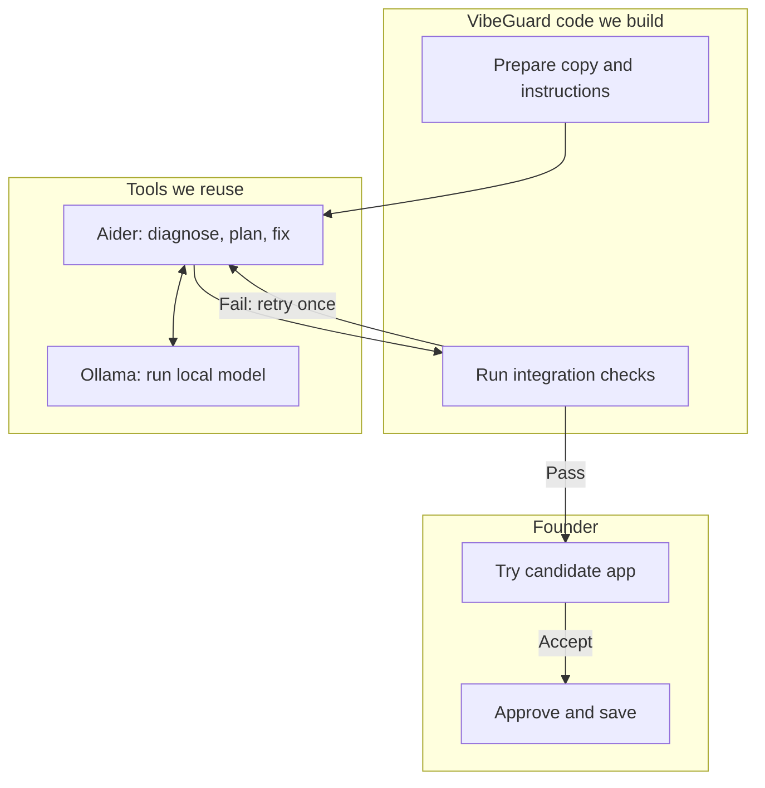

# Local AI and harness plan

We use **Aider to edit code**, **Ollama to run the local model**, and **the VibeGuard runner to control the repair and check its results**.

**Status:** the laptop calculator trial passed. Real CRUD repair and container isolation still need proof. This document describes the planned integration.

## The flow

After two failed attempts, or when verification cannot run, show **No verified fix ready**. The founder performs end-to-end testing in the preview; automated checks focus on high-level integration behavior.

## Does Aider already work?

Yes. Aider reads supplied files, calls Ollama, and applies edits. Our calculator trial demonstrated that path. We configure the existing tool and call it from the runner. See [Aider usage](https://aider.chat/docs/usage.html).

We still write the wrapper that supplies the right copy and evidence, enforces permissions and attempts, captures the diff, runs independent checks, and returns the preview. Prompt instructions guide investigation and code quality. Runner code and container permissions enforce the boundaries.

## What the agent receives

- The founder's confirmed goal and baseline evidence reproducing the bug.
- Relevant source files that fit the context budget, plus an allowed edit scope.
- Instructions to trace the cause, make a focused maintainable fix, add useful integration regression tests, and review the diff.

Start with supplied files and evidence. Add bounded diagnostic steps if the trial needs them. Aider's file selection does not restrict filesystem access; the sandbox must enforce that.

## The senior engineering approach

We design the repair around these principles:

- **Diagnose before editing.** Trace the user action through application logic to persistence. Cite relevant code and observed failures. Separate facts from hypotheses; request missing evidence instead of inventing logs or results.
- **Fix the cause.** Explain why the change should correct the failure. Keep the scope focused, preserve working behavior, and handle errors without reporting false success.
- **Improve the affected code's structure.** Assume the imported project may mix UI, business logic, and database calls in one JavaScript file. Untangle the affected path into clear responsibilities, give persistence an explicit interface, and handle failures explicitly. Refactor as much as the reliable fix needs, explain why, and protect working behavior with integration tests. Preserve sound existing structure where present; do not preserve broken patterns for consistency.
- **Protect behavior with integration tests.** Exercise public application actions across real production layers. Cover the reported failure, a neighboring regression, and relevant error behavior. Fake external dependencies at clear seams; do not mock the whole orchestrator.
- **Review before handoff.** Compare the diff with the plan. Flag unexpected file changes, weakened validation, and dependency or schema changes. Use independent check results as evidence; the model's review cannot establish acceptance.

We make diagnosis a separate step rather than relying on a single “act like a senior” prompt:

| Step | Required output |
| --- | --- |
| Diagnose and plan, with read-only source | Suspected cause, evidence references, affected files, needed structural improvements, proposed change, regression risks, and test plan |
| Implement on the candidate | Root-cause fix, justified refactoring of the affected path, and useful integration regression tests |
| Review and check | Diff against the plan, protected integration results, and any unresolved issues |

Use the same local model sequentially: Aider [ask mode](https://aider.chat/docs/usage/modes.html) for diagnosis, then code mode for implementation. Enforce read-only source permissions during diagnosis. The runner requires a complete report and an in-scope plan before enabling edits; report completeness does not prove the diagnosis correct. Pass the report into the edit call so the plan survives between processes.

Each of the two repair attempts allows one diagnosis call and one edit call. A failed phase consumes that attempt; automatic retries remain disabled. After failed integration checks, the next attempt must reconsider the cause using the new evidence. The founder receives a short cause/change summary, check results, and candidate preview.

## Configuration

| Setting | Starting choice |
| --- | --- |
| Tools installed on the laptop | Aider 0.86.2; Ollama 0.40.2 |
| Model | `qwen2.5-coder:7b`, CPU inference |
| Context | 8,192 tokens, including input and output; configure Aider too |
| Concurrency | One loaded model, one inference request, one active runner job |
| Repair budget | Two attempts, each with at most one diagnosis and one edit invocation; no automatic repair loops |
| Timeout | Generous finite limit, calibrated from laptop trials |
| Model switching | Runner-owned profile; switch between jobs and requalify |

Use one-shot Aider execution with runner-owned configuration. Disable automatic commits, analytics, update checks, and imported hooks/configuration. Capture process output, exit status, duration, and changed files. An exit code of zero does not establish a fix.

Store the model tag/digest, context, output budget, edit format, and timeout in the profile. Fail clearly if its model is unavailable offline. See [Aider's Ollama configuration](https://aider.chat/docs/llms/ollama.html) and [options](https://aider.chat/docs/config/options.html).

## Checks and protection

- Keep originals, protected checks, approval records, host credentials, and the Docker socket outside Aider's write access.
- Allow local inference connectivity; block external network access during repair. Test the container-to-WSL Ollama route.
- Reject changes outside the allowed scope. Freeze the candidate version before checking it.
- Run protected integration checks on a fresh copy with controlled data and real local database persistence. Agent-written tests supplement these checks.
- Keep application layers real in tests; fake external dependencies at clear interfaces. Follow the [test guidance](../verification/README.md).
- Return evidence and a preview for the exact checked version. Changes require new checks; founder approval saves that version.

Process failures, timeouts, or cancellation cannot produce a checked candidate. Jobs stay in memory; a runner restart requires a new job, with no automatic recovery.

## Next work

1. **Other engineer:** supply the runnable JavaScript/Supabase fixture, local database setup, preview, and real baseline check.
2. **Our thread:** run a standalone repair trial using an isolated candidate, Aider, and independent integration checks.
3. **Qualify:** repeat clean trials; record diagnosis, diffs, regression results, failures, runtime, and full-stack memory. Check network isolation and include human preview testing. Prefer reliability over speed.
4. **Integrate:** connect the same repair operation to the existing repair job API and dashboard. Complete two offline rehearsals.

Keep orchestration in the existing runner; use shared contracts, with no queue or separate worker. Goal conversation uses Ollama directly through the existing conversation adapter; Aider handles code repair.

For installation, use the [laptop setup guide](demo-laptop-setup-guide.md). For model alternatives and hardware research, use [local AI reliability research](local-ai-reliability-research.md).
