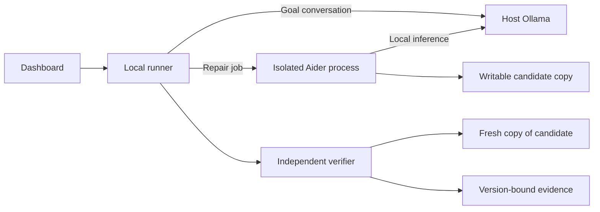

# Local AI and harness plan

Status: proposed, 2026-10-09. This work can proceed alongside shared contracts. We have not installed or benchmarked the demo laptop, selected the demo app, or proved a repair.

Use Aider with Ollama as the first experiment. Existing project docs name Aider; confirm whether “Aether” refers to Aider or another tool before implementation. Choose the model after repeated offline repairs on the demo laptop. The owner prioritizes correct investigation and checked fixes over speed and requires stable execution. See [local AI reliability research](local-ai-reliability-research.md).

## Laptop information needed

For step-by-step setup commands and prompts to use with a local coding agent, follow the [demo laptop setup guide](demo-laptop-setup-guide.md).

Record OS/version, CPU/chip, total RAM, GPU model and dedicated VRAM (or Apple unified memory), free SSD space, and whether Docker works. Record Docker/WSL memory limits where applicable. The remote development environment's hardware does not establish the demo laptop's capacity.

Demo laptop supplied by the owner: Windows with WSL Ubuntu, AMD Ryzen 5 7535U, 32 GB RAM (30.8 GB usable), and 118 GB free disk. Confirm Windows/WSL versions, the displayed GPU model, and Docker readiness during setup. Device and product IDs are unnecessary for this work.

Given the limited experiment time, start with Qwen2.5-Coder 7B and qualify it on the actual app. It is a coding-focused model, not DeepSeek R1 Distill Qwen 7B; we have no measured evidence that the distilled model repairs better. Keep Qwen3 4B Instruct as a configured fallback, downloading it only if needed. RAM and disk look sufficient for that experiment; inference latency remains unmeasured. Budget for CPU inference until GPU placement proves otherwise. Do not assume the integrated Radeon will accelerate inference inside WSL. GPU availability depends on the WSL driver/backend path; test it only after the CPU baseline works. See [Ollama hardware support](https://docs.ollama.com/gpu). Consider 14B only if the smaller candidates fail repair-quality checks and measured memory headroom permits it; added latency is acceptable.

Budget for the OS, browser, runner, Docker app/database, verifier, and model together. Model download size does not equal inference memory: context and runtime buffers need additional space. CPU inference is the baseline. Record latency for presentation planning; select on repair quality and stable execution.

## Model experiment

Qualify quantized Qwen2.5-Coder 7B first. If it passes the repair and stability criteria, freeze it and move to integration. Compare a fallback only when observed failures justify it. The table records alternatives, not a requirement to benchmark them all.

| Candidate | Model download | Proposed laptop tier to test | Use |
| --- | --- | --- | --- |
| `qwen2.5-coder:3b` | 1.9 GB, Q4_K_M | 8–16 GB RAM; whole-stack fit remains uncertain at 8 GB | Lighter fallback; must pass the same repair checks |
| `qwen2.5-coder:7b` | 4.7 GB, Q4_K_M | Start here at 16 GB RAM; GPU/unified-memory capacity affects speed | First repair candidate |
| `qwen3:4b-instruct-2507-q4_K_M` | 2.5 GB, Q4_K_M | Test on the supplied 32 GB laptop | Smaller general instruction-following challenger |
| `qwen3.5:4b` | About 4.0 GB total listing; verify exact pinned artifact | Test on the supplied 32 GB laptop | Newer challenger; qualify runtime and bounded-context behavior |
| `qwen2.5-coder:14b` | Check exact tag size before downloading | Consider at 32 GB RAM with enough GPU/unified memory | Escalate if 7B fails and hardware has headroom |

These RAM tiers are planning estimates, not vendor minimums or guarantees. Dedicated VRAM is separate from system RAM; Apple unified memory serves both CPU and GPU. Measure the full demo under load. Reserve a provisional 20–30 GB of free disk for one model, tooling, images, and working copies; revise after measuring the app.

Download and quantization values come from the [3B](https://ollama.com/library/qwen2.5-coder:3b) and [7B](https://ollama.com/library/qwen2.5-coder:7b) listings. Do not extrapolate 32B benchmark results to these smaller models.

Start with one loaded model, one inference request at a time, and an 8,192-token context. Budget input plus output, reject requests that cannot fit, and use smaller investigation steps rather than silently truncating source or evidence. Explicitly fix Aider's model context settings too: Aider can increase the requested window beyond the server default. Keep relevant source files and a short failure report within that budget; increase it only after measuring memory. Use [Aider's Ollama configuration](https://aider.chat/docs/llms/ollama.html) and verify the effective context during the spike.

## Runtime integration

### Model switching without changing the app

Keep one runner-owned profile configuration with an active profile ID. Implement this in the existing runner; a provider framework or model-selector screen is unnecessary for the demo.

| Profile | Ollama tag | Initial role |
| --- | --- | --- |
| `coder-7b` | `qwen2.5-coder:7b` | Default; qualify first |
| `instruct-4b` | `qwen3:4b-instruct-2507-q4_K_M` | Manual fallback if needed |

Each profile owns its model tag/digest, context limit, output budget, sampling/thinking settings when supported, Aider edit format, and calibrated timeout. Keep the local service URL separate so profiles share the same WSL Ollama instance. Derive both conversation requests and `ollama_chat/<tag>` harness arguments from the selected profile; avoid model names embedded in feature handlers.

To switch, select a profile in runner configuration and run readiness checks for the installed artifact, inference, and harness edit compatibility. Downloads belong to online preparation; fail with a next step if a selected model is missing offline. Reject profile changes while AI jobs are active, then unload the old model before warming the new one. Apply the switch to future jobs only. Snapshot the profile settings and actual model digest into each job's local metadata so results remain attributable.

Use manual switching during setup. An automatic fallback can consume extra attempts, hide failure causes, and change behavior midway through a repair. Keep the two-attempt accounting explicit. Rerun repair qualification after changing models or meaningful settings; switching configuration does not establish repair capability. Reuse shared contract types for public results; profile configuration stays internal.



Run the Linux Ollama service directly in WSL Ubuntu. Run the local runner and verification tooling in the same distribution, with app/database and repair isolation in Docker. Here, “host Ollama” means the WSL Linux host outside the repair container. Confirm the effective CPU/GPU backend on this laptop. Configure local-only Ollama, loopback binding, one loaded model, and one parallel request using the [Ollama FAQ](https://docs.ollama.com/faq).

The repair container needs a tested route to host Ollama. Loopback inside a container is not host loopback. Choose an OS-specific private bridge/relay during the spike and permit only that local inference endpoint; keep it off the LAN. Do not expose unrestricted host networking to solve connectivity. Verify inference and denied internet access from inside the container.

### WSL Ubuntu setup order

Use WSL 2 Ubuntu for the full runtime: Linux Ollama, Node/pnpm runner/dashboard server, Aider, verifier, Docker Engine, and app/database containers. Windows hosts WSL and can provide the browser for the local dashboard. Native Windows Ollama and Docker Desktop are optional; neither is required for this setup.

Confirm WSL 2 and enable/check systemd for service startup using [Microsoft's WSL service instructions](https://learn.microsoft.com/en-us/windows/wsl/systemd). Install [Linux Ollama](https://docs.ollama.com/linux) and [Docker Engine for Ubuntu](https://docs.docker.com/engine/install/ubuntu/) inside the distribution. Check an existing Docker installation before introducing another daemon; select one engine for the demo.

Keep project copies and model storage in the WSL Linux filesystem. Verify WSL's effective memory allowance before loading the full stack, since installed Windows RAM does not equal its VM allocation. Start with a provisional 20 GB WSL memory cap on this 32 GB laptop, leaving Windows headroom, then adjust from measured peak usage. Changing WSL's global memory limit uses the Windows-side `.wslconfig` and requires a WSL restart; application services still run in Ubuntu.

Download the default from WSL during online preparation; fetch a fallback only when needed:

```sh
ollama pull qwen2.5-coder:7b
```

Configure local-only mode, concurrency, and context in the Linux Ollama service environment and restart it. For initial runner/Aider smoke tests outside containers, use `http://127.0.0.1:11434` from the same WSL distribution. Keep the existing container isolation plan for actual repair: its loopback address is separate, so provide a restricted bridge/relay to WSL-hosted Ollama and test denied external access.

Measure CPU inference first, compare repair quality and memory stability, and freeze the chosen configuration after the protected repair spike. Check dashboard access from the Windows browser and service recovery after restarting WSL. These are laptop setup instructions to execute there; this planning change does not install tools on the owner's laptop.

Use two small runner integrations:

- **Goal conversation:** call Ollama's [chat API](https://docs.ollama.com/api/chat) with bounded history. Request a reply and proposed goal using [structured outputs](https://docs.ollama.com/capabilities/structured-outputs), then validate against agreed contracts. Malformed output gets a readable failure or one bounded retry. The founder confirms the goal; model output cannot confirm it.
- **Repair:** launch Aider as a child process in the isolated candidate workspace. Provide the confirmed goal, baseline evidence, relevant app files, and allowed edit scope. Invoke it with an argument array and a runner-written message file. Capture output, exit status, duration, and resulting diff. The runner decides whether a candidate exists; the independent verifier decides whether it passes.

For the pinned Aider release, test `--model ollama_chat/<tag>`, `--message-file`, `--no-auto-commits`, `--no-auto-lint`, `--no-auto-test`, `--no-analytics`, `--no-check-update`, and `--no-show-release-notes`. These support one-shot execution and runner-owned verification; check them against the installed release's help and [options reference](https://aider.chat/docs/config/options.html). Disable automatic lint/test repair loops so the runner can enforce its two-attempt limit. Use runner-owned configuration and a sanitized environment; do not load imported Aider config, credentials, or hooks.

Do not parse Aider prose as an API result or treat exit code zero as proof of a fix.

## Contracts to coordinate with the other thread

Use the shared operation types described in [backend foundations](backend-foundations.md). This document proposes integration needs; the contracts owner chooses names and shapes in `packages/contracts`.

| Boundary | Needed information |
| --- | --- |
| AI preparation/readiness | Service reachable, exact downloaded model available, successful inference, harness available; readable failure/next step |
| Goal conversation | Project/job reference, bounded messages, reply, proposed goal and revision |
| Repair input | Project, source version, confirmed goal revision, baseline evidence references, attempt number |
| Repair result | Candidate version reference, change summary/diff reference, attempt count, failure when no candidate is ready |
| Job progress | Preparing model, investigating, editing, checking, finished; existing shared job lifecycle |

Keep paths, commands, model process details, and sandbox handles internal to the runner. Keep model/tool version and timing in local run metadata. Separate service availability, app setup readiness, and measured repair capability. A health endpoint does not establish any of these.

## Repair execution and protections

1. Require prepared app/database, confirmed goal, and a baseline that reproduces the issue. An inconclusive baseline needs resolution before repair.
2. Create an isolated writable candidate from the source version. Mount only its allowed app files and temporary process storage. Keep originals, protected checks, job records, approval records, and Docker socket outside the repair process's access. Drop privileges and unnecessary capabilities; reject symlink/path escapes.
3. Run one Aider invocation with a timeout calibrated from CPU trials, allowing slow progress. Remove the earlier five-minute cutoff. Separate model loading, prompt processing, and generation from a stalled process; a runner heartbeat alone does not prove inference progress. Set explicit context/output budgets and a generous finite ceiling after measuring complete runs. Stream bounded founder-readable progress; store sanitized diagnostic output locally. Cancellation stops the process/container and discards partial candidates. A timeout consumes an attempt and cannot produce an approved version.
4. Freeze and identify changed candidate content. Reject edits outside the allowed scope. The runner prepares/builds and checks a fresh copy with fresh test data, including real persisted CRUD data. Execute imported code in the app environment, with protected verification artifacts inaccessible for modification.
5. On failed checks, provide sanitized evidence for one more repair attempt from the prior candidate. Count at most two repair invocations per repair job; do not restart a hidden attempt counter after failure/restart. Use the same confirmed goal and protected checks.
6. Return the candidate and version-bound evidence when required checks pass. Otherwise show that no verified fix is ready. Approval/export must use the exact checked version. Invalidate stale results when code or goal revisions change.

On runner restart, recover interrupted jobs as failed/interrupted using the agreed lifecycle and structured error. Retain diagnostics and attempt count; require a deliberate new job to continue. Keep attempts and candidates distinguishable.

## Preparation and proof

Complete these steps on the demo laptop, with Engineer 2 owning inference/harness, Engineer 3 owning app/isolation, and Engineer 4 owning verification:

1. **Online preparation:** install host Ollama and the pinned harness/toolchain; download the selected model, app dependencies, browser binaries, and Docker images. Record tool versions, model digest/quantization, context, and hardware. Warm up both conversation and Aider paths so lazy downloads surface.
2. **Connectivity/isolation:** demonstrate container-to-host inference, denied external network access, and denied writes to originals/checks/approval state. Expose only sanitized failure evidence to Aider.
3. **Repair spike:** use a reproducible CRUD bug in a small app with a real database. Ask the model to investigate from goal and observed failure, without supplying the patch. Reproduce failure, repair within two attempts, and pass all CRUD checks on fresh data. Measure cold/warm conversation and total repair/check duration, peak memory, and GPU/CPU placement (`ollama ps`).
4. **Model decision:** qualify the default by correct diagnosis, verified fixes, regression results, and stable execution. Remove the earlier 15-second/three-minute speed targets. Run five clean end-to-end trials on the primary bug, plus neighboring CRUD regressions and an inconclusive/dependency-failure case. Require no runtime crashes or false pass claims in this qualification batch and report verified success counts; a small batch does not guarantee future reliability. If the default qualifies, proceed without a model tournament. Otherwise switch profiles and compare against the recorded failures. Keep a slower candidate if it repairs more cases correctly. If none qualifies, report the blocker before committing.
5. **Offline rehearsal:** disconnect internet, restart VibeGuard and its services, and complete all five stories twice. Confirm fresh inference, saved export startup, cancellation/failure handling, and a retained check catching a reintroduced regression. Wi-Fi disconnection alone does not prove absence of other external network paths; enforce and observe egress restrictions too.

Save a sanitized run report with hardware/settings, timings, attempts, diffs, and verification references. Until this proof exists, label the model and harness as candidates and AI repair as unimplemented.

## Implementation sequence

Prove laptop inference and the standalone repair first while contracts proceed. Then integrate readiness and goal conversation, connect bounded Aider jobs, and wire verifier results into approval/export. Reserve the final integration time for two offline rehearsals. Use mock contract fixtures for dashboard progress while these operations remain unavailable, and label simulated results.
