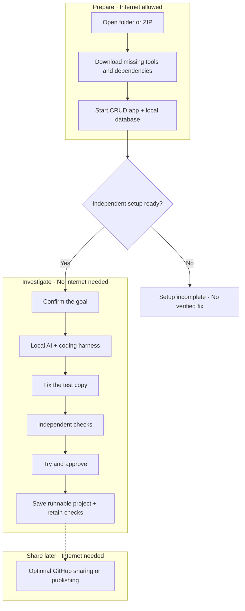

# VibeGuard: simple system design

The founder uses a browser dashboard. A local runner on their computer handles the app, AI, and checks.

## The pieces

| Piece | Job |
| --- | --- |
| Dashboard | Project picker, text conversation, evidence, preview, approval |
| Local runner | Setup, job coordination, local results, fixed-project export |
| Docker | Simple CRUD app, real local database, and separate test data |
| Ollama + downloaded model | Understand the goal and investigate |
| Existing harness, candidate: Aider | Inspect and edit the test copy |
| Independent verifier | Protected checks, evidence, before/after timings |

Aider supports local Ollama models. Test its repair quality and speed on the demo laptop before committing to a model. Prepare app dependencies as well as Docker images.

## Rules

**Ready means the demo app and database can run without the founder’s platform.** If setup fails, show **Setup incomplete**. We must reproduce the issue before repairing it. A mocked database is not proof that the project runs independently.

- After setup, the required AI, app services, and checks work without internet.
- Keep original files and customer data separate. Keep checks outside the agent’s writable files.
- Approval saves the exact checked code, service setup, run instructions, and retained checks as a separate project copy. Rerun retained checks on later local versions. Changed code needs new checks; changed goals also need confirmation.

V1 uses text. Hosted Jev, cloud voice, Codex, and E2B leave the required flow. Optional local jevos selects goal-clarification questions on the CPU; Qwen writes goal drafts and repairs. See [jevos setup](jevos-setup.md). Local voice and GitHub sharing can follow.

References: [Ollama local-only mode](https://docs.ollama.com/faq#how-do-i-disable-ollama-cloud-features) · [Aider with Ollama](https://aider.chat/docs/llms/ollama.html) · [Docker image downloads](https://docs.docker.com/reference/cli/docker/image/pull/).

Related: [Build plan](scope-and-tech-requirements.md).
